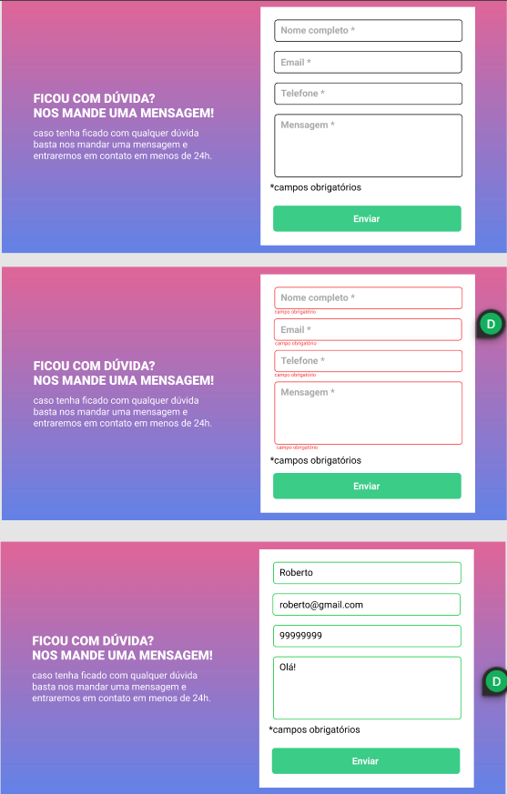
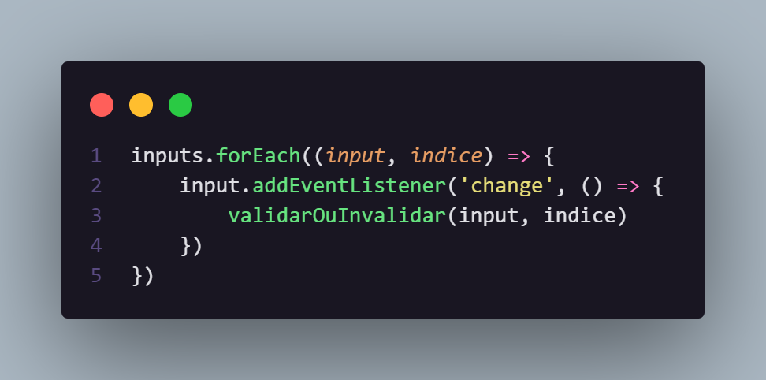
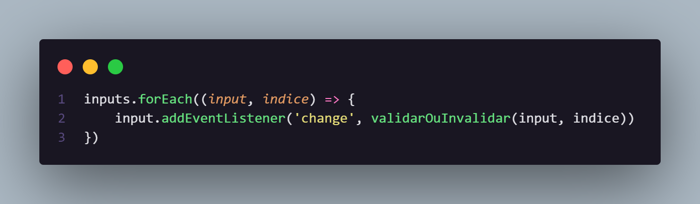

# Solução da Quest - Formulário com validação

Esta é uma solução da quest do curso de programação do Dev em Dobro.

## A quest

O exercício consiste em fazer um formulário com validação das informações de acordo com o layout passado no Figma:

Quando o usuário preenche algum campo, ele deve ficar com a borda verde. Mas, quando o campo não for preenchido, a borda ficará vermelha com uma mensagem abaixo dizendo: campo obrigatório.

### Feito com:

- HTML
- CSS / Flexbox
- JavaScript

## Experiência

Pude praticar os conceitos de criação de formulários, uso de tags `input` e posição de elementos e estilização com CSS. 

Também pude reforçar os aprendizados de JavaScript e aplicá-los em um projeto real.

### Dificuldades

Durante o desafio, fiquei de frente com o problema de otimizar meu código JS.

Um dos trechos do meu código ficou assim:

Porém, não consigo entender porque a função anônima encurtada não poderia ser substituída pela própria função `validarOuInvalidar` diretamente.

Quando faço isso, os campos para colocar as informações são automaticamente colocados como inválidos e com bordas vermelhas, mesmo que eu não tenha digitado e apagado nada dentro do `input` ou clicado no botão de Enviar.